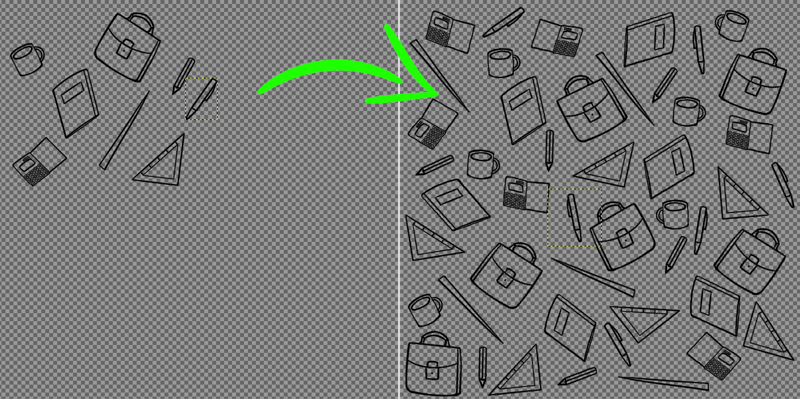
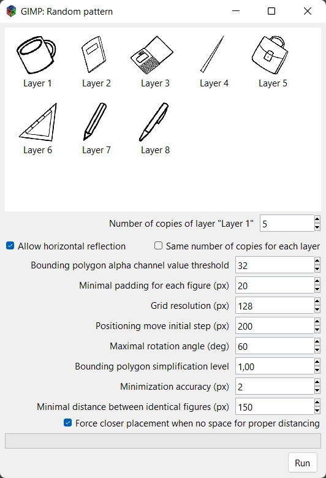

# Random pattern texture generation plugin for GIMP

### Usage

At first, place the figures on the canvas and enlarge it to desired size. Then select `Filters->Artistic->Random pattern texture...`

### Installation
Make sure you've installed the `pip` package manager for your GIMP's Python 2 installation (GIMP on Linux usually uses systemwide Python 2).

Then run `python -m pip install -r requirements.txt` to install plugin's dependencies.

Finally, place `genpattern` directory from this repo into your GIMP's `plug-ins` directory.
